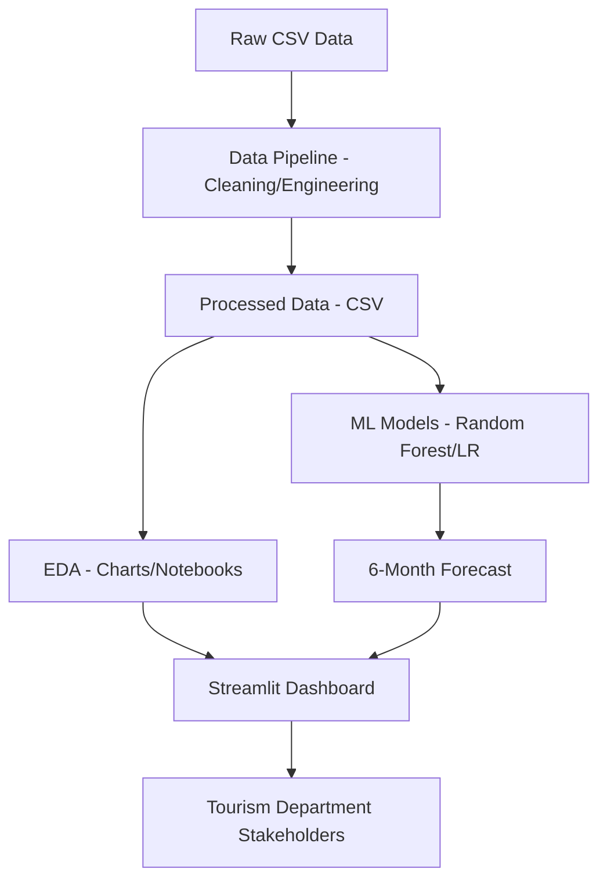

# Milestone 4.1 — Technology Orientation

## What is Data Science?
Data Science is an interdisciplinary field that uses scientific methods, processes, algorithms, and systems to extract knowledge and insights from structured and unstructured data. It combines elements of mathematics, statistics, computer science, and domain expertise.

## The Data Science Lifecycle
1.  **Business Understanding**: Defining the problem and goals.
2.  **Data Acquisition**: Gathering relevant data.
3.  **Data Preparation (Cleaning/Engineering)**: Processing raw data for analysis.
4.  **Exploratory Data Analysis (EDA)**: Finding patterns and trends.
5.  **Modeling**: Building predictive models.
6.  **Deployment**: Making the model available to stakeholders (Dashboards/APIs).

## How BheedRadar Maps to the Lifecycle
*   **Data**: Loading raw tourist footfall data.
*   **EDA**: Visualizing trends and correlations in visitor counts.
*   **Modelling**: Using regression and Random Forest to forecast footfall.
*   **Dashboard**: Displaying insights via a Streamlit interface.

## Real-World Impact
BheedRadar aims to solve the problem of "blind operation" in tourism departments. By predicting footfall, cities can:
*   **Transport**: Optimize bus and train schedules to prevent overcrowding.
*   **Cleanliness**: Deploy sanitation crews more effectively in high-traffic zones.
*   **Safety**: Ensure adequate police and medical presence based on crowd forecasts.

### Case Studies
*   **Amsterdam City Dashboard**: Uses real-time data to manage crowd flow in popular areas.
*   **Venice "Smart Control Room"**: Tracks visitor numbers to implement entry fees and manage peaks.

## High-Level Architecture

