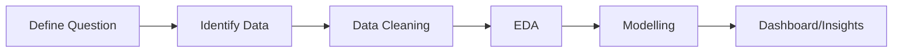

# Milestone 4.2 — Understanding the Data Science Lifecycle

## Problem Definition
**Question**: Can we predict tourist footfall per city, zone, and month to help urban departments manage resources?
**Impact**: By forecasting "bheed" (crowds), we can improve transportation, sanitation, and safety.

## Data Identification (Schema)
To answer this question, we need a dataset with the following columns:
*   `city`: Name of the city (e.g., Jaipur, Goa, Shimla).
*   `zone`: Specific area within the city (e.g., Zone 1, Zone 2).
*   `date`: Month and year of the observation.
*   `visitor_count`: Number of tourists recorded.
*   `temperature`: Average temperature for the month.
*   `is_holiday`: Boolean flag (True/False) for whether the month contains major public holidays.

## Expected Insights
1.  **Seasonal Peaks**: Which months are consistently the busiest across different cities?
2.  **City-Level Risk**: Identifying cities with the highest footfall volatility.
3.  **Department Actions**: Mapping footfall levels to specific resource needs (e.g., "High footfall => Increase sanitation frequency").

## Output Artifacts
*   **Forecast Table**: Predicted visitor counts for the next 6 months.
*   **Risk Matrix**: A table mapping cities and zones to risk levels (Low/Medium/High).
*   **Streamlit Dashboard**: An interactive tool for stakeholders to explore projections.

## Lifecycle Diagram

